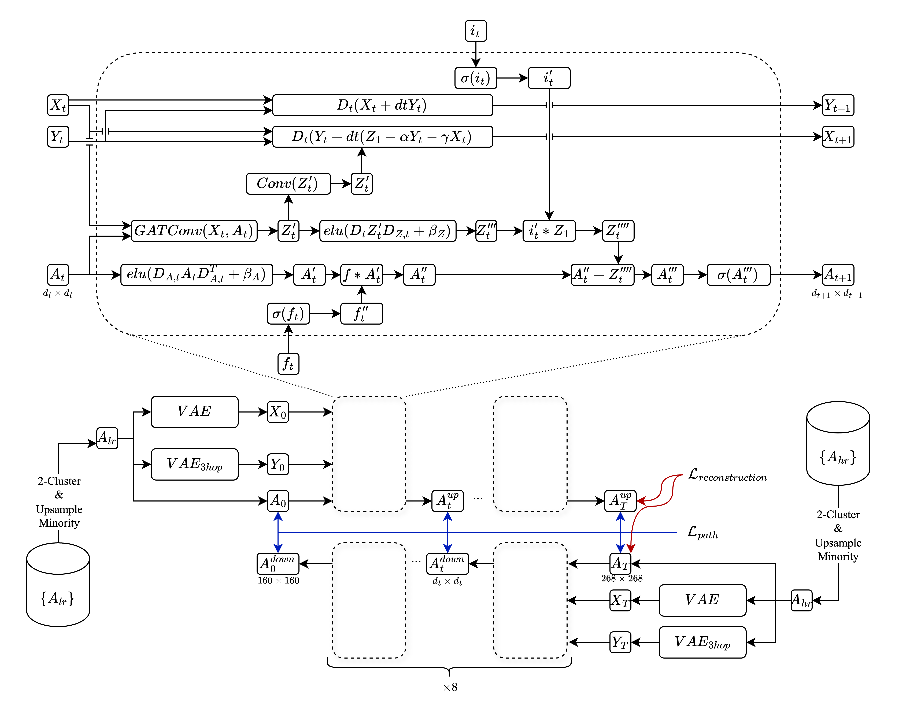
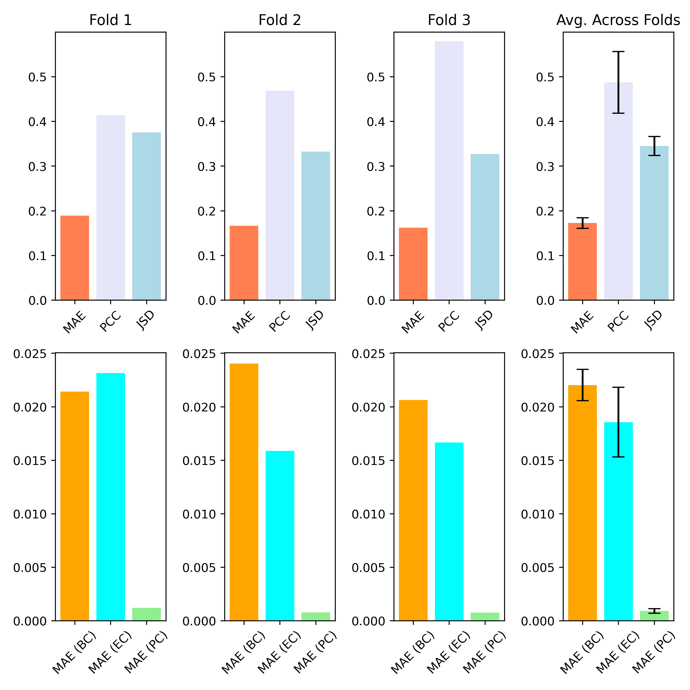

# DGL2024 Brain Graph Super-Resolution Challenge

## Contributors

Team Name: Zeroth Degree Graph
Learners
Team Members: Sadegh Emami, Timothy Wong, Dilay Ercelik, Moritz Hauschulz, Konstantinos Mitsides

## Problem Description


We develop a novel approach to brain graph super-resolution. Brain graph super-resolution is the task of predicting high resolution connectivity matrices of brain regions from low resolution ones. Since the cost of obtaining high-resolution connectivity matrices is high, there is significant scientific value in learning to predict them from their low-resolution counterparts, which are cheaper to obtain, and for which more data already exists. Such high-resolution data can then be used for down-stream research, such as Alzheimers detection. The problem is a natural application of graph-based deep learning since brain connectivity matrices can be interpreted as adjacency matrices of graphs, in which each node represents a brain region. We use data derived from the Slim dataset described in Liu et al, 2017 (https://www.nature.com/articles/sdata201717).

## GraphNETbyNET - Methodology
Our model, **GraphNETbyNET** consists of an UpChanger and a DownChanger network. The UpChanger gradually changes the number of nodes, i.e. the dimensions of the adjacency matrix from low to high, while the DownChanger gradually decreses the dimensions by the same step size (hence the name of our model). Each step consists of a so called Graph Convolution Block, which adjusts the size of two (!) feature matrices through a learned transformation and transforms the adjacency matrix via a Gatv2Conv Layer. The presence of two feature matrices is inspried by the Graph-Coupled Oscillator Network (GraphCon) proposed in Rusch et al, 2022 [11]. The blocks also include input and forget gates inspired by LSTM models [13]. The key contribution of our model is that it is trained by alternating the training of the UpChanger and DownChanger, and computing losses between adjecency matrices at each step between the two networks, thereby stabilising the upwards and downwards paths of the adjacency matrices. We further use a reconstruction loss of passing a high-resolution matrix through the DownChanger first and then through the UpChanger, akin to a Graph U-net architecture [9]. We use VAEs to obtain initial node feature embeddings, and perform upsampling on graphs from the minority class of the clustered low-resolution data in a pre-processing step.



## Used External Libraries

To install the necessary packages, create an empty virtual environment and run the below code.

```
pip install -r requirements.txt
```

## Results




## References

[1] H. X. Q. L. W. Y. R. C. S. R. E. . Z. C. Chen, H., “Real-world single
image super-resolution: A brief review,” Information Fusion, vol. 79,
pp. 124–145, 2022.

[2] R. J. D. B. A. V. H. J. D. . B. S. Y. Brown, J. A., “The ucla multimodal
connectivity database: a web-based platform for brain connectivity
matrix sharing and analysis,” Frontiers in Neuroinformatics, vol. 6,
no. 28, 2012.

[3] C. J. H. S. C. L. S. P. G. . Z. Y. Shan, X., “Spatial–temporal
graph convolutional network for alzheimer classification based on brain
functional connectivity imaging of electroencephalogram,” Human Brain
Mapping, vol. 43, no. 17, pp. 5194–5209, 2022.

[4] . R. I. Isallari, M., “Gsr-net: Graph super-resolution network for predict-
ing high-resolution from low-resolution functional brain connectomes,”
Machine Learning in Medical Imaging: 11th International Workshop,
MLMI 2020, vol. 12436, pp. 139–149, 2020.

[5] . R. I. Isallari, M., “Brain graph super-resolution using adversarial
graph neural network with application to functional brain connectivity,”
Medical Image Analysis, vol. 71, no. 102084, 2021.

[6] N. A. M. M. A. . R. I. Mhiri, I., “Non-isomorphic inter-modality
graph alignment and synthesis for holistic brain mapping,” International
Conference on Information Processing in Medical Imaging, pp. 203–
215, 2021.

[7] K. A. B. M. M. A. . R. I. Mhiri, I., “Brain graph super-resolution
for boosting neurological disorder diagnosis using unsupervised multi-
topology connectional brain template learning,” Medical Image Analysis,
vol. 65, no. 101768, 2020.

[8] . R. I. Rajadhyaksha, N., “Diffusion-based graph super-resolution with
application to connectomics,” International Workshop on PRedictive
Intelligence In MEdicine, pp. 96–107, 2023.

[9] H. Gao and S. Ji, “Graph u-nets,” 2019.

[10] T. K. Rusch, M. M. Bronstein, and S. Mishra, “A survey on oversmooth-
ing in graph neural networks,” 2023.

[11] T. K. Rusch, B. P. Chamberlain, J. Rowbottom, S. Mishra, and M. M.
Bronstein, “Graph-coupled oscillator networks,” 2022.

[12] S. Brody, U. Alon, and E. Yahav, “How attentive are graph attention
networks?,” 2022.

[13] S. Hochreiter and J. Schmidhuber, “Long short-term memory,” Neural
computation, vol. 9, no. 8, pp. 1735–1780, 1997.